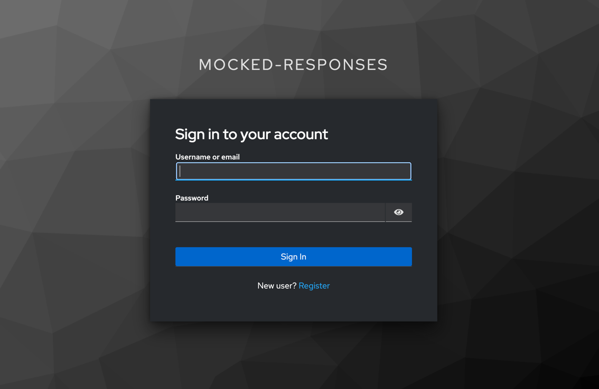
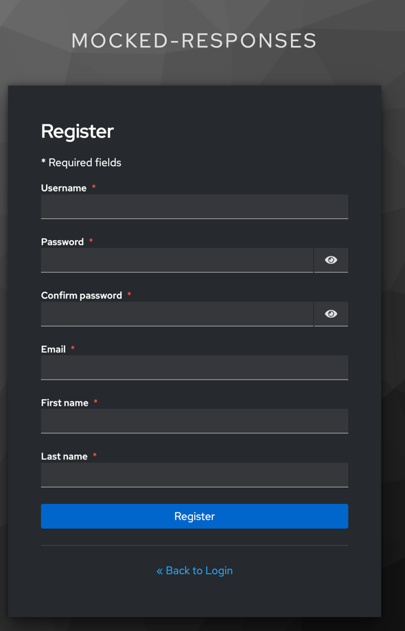
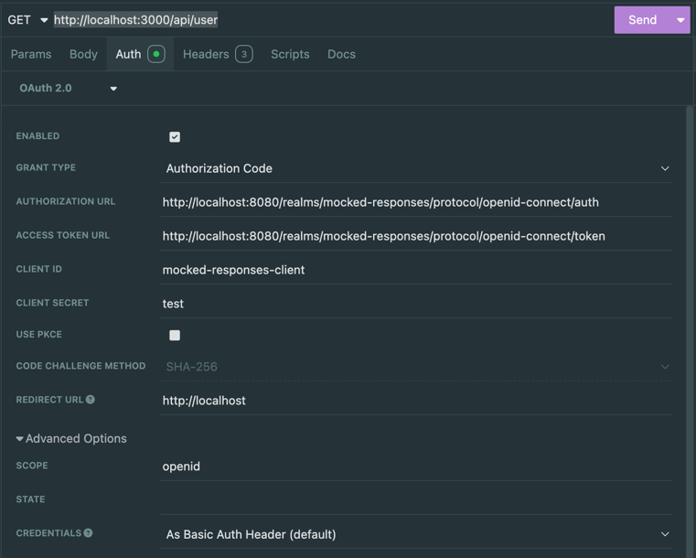

# Flutter Dio Mocked Responses Example

This example demonstrates how to use `dio_mocked_responses` with a complete setup, including:
- A containerized API,
- A Keycloak authentication server,
- A Flutter Web application hosted in a container,
- Authentication via OpenID Connect (OIDC) using `dio_oidc_interceptor`,
- API calls to retrieve user information.

## Getting Started

### Prerequisites
Ensure you have the following installed:
- [Docker](https://docs.docker.com/get-docker/)
- [Flutter](https://flutter.dev/docs/get-started/install) (for running tests and modifying the application)

### Installation & Running the Application
1. Clone the repository:
   ```sh
   git clone https://github.com/Listo-Paye/dio_mocked_responses.git
   cd dio_mocked_responses/example
   ```

2. Start the containers using Docker Compose:
   ```sh
   docker compose -p mocked_responses up -d --build
   ```
   This will build and launch:
    - The API server at `http://localhost:3000`
    - The Keycloak authentication server at `http://localhost:8080`
    - The Flutter web application at `http://localhost`

3. Open `http://localhost` in a browser to access the Flutter web app.

### Authentication
- Use the login page to authenticate with your credentials.



- If you do not have an account, register using the registration page.



- Once logged in, API calls will be authenticated and return user information.

### API Calls
- The application makes authenticated requests to:
  ```http
  GET http://localhost:3000/api/user
  ```
  This endpoint returns the connected user's name and email.
- The `dio_oidc_interceptor` package handles authentication tokens automatically.

Example API call using Insomnia:



## Preparing the Codebase
To modify the code or run tests, follow these steps:

1. Install dependencies:
   ```sh
   flutter pub get
   ```

2. Generate required files:
   ```sh
   flutter pub run build_runner watch --delete-conflicting-outputs
   ```

3. Run the tests:
   ```sh
   flutter test
   ```
   The tests use:
    - Gherkin scenarios (`bdd_widget_test`)
    - Dependency injection
    - Clean architecture principles

## Notes
- Ensure that all services are running properly by checking Docker logs:
  ```sh
  docker compose logs -f
  ```
- Stop the containers when done:
  ```sh
  docker compose down
  ```

## Additional Information
This example showcases best practices such as:
- Test-Driven Development (TDD)
- Behavior-Driven Development (BDD)
- Domain-Driven Design (DDD)
- SOLID principles

If you encounter any issues, feel free to open an issue in the repository!
